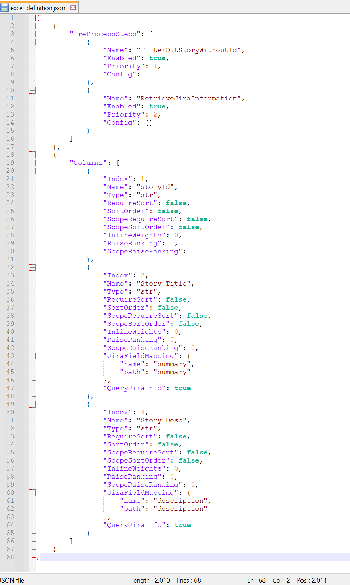

# Create Jira Story

Inside this package, there is a shell command named `process-excel-file` and using this tool can create Jira stories based on the information from the Excel.

## Step 1: Prepare the definition file

## Step 2: Prepare the Excel file

## Step 3: Running the shell command

## Step 4: Congratulations!!!

Now, you can see the **excel_sorted.xlsx** file has been created successfully!

