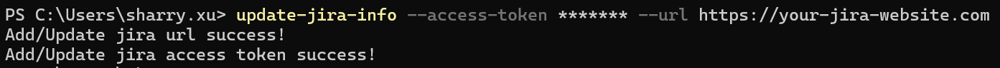

# Create Jira Story

Please note that there is a shell command inside this package called `process-excel-file` that can be used to create Jira stories based on the information from an Excel file.

Before proceeding with the steps below, it is important to ensure that the Jira-related information has been configured correctly. You can run the `update-jira-info` command to do this, as shown in the image below:



For more information about this command, please refer to the [update_jira_info](../reference/update_jira_info.md) page.

## Step 1: Prepare the definition file

To create a definition file that contains the `CreateJiraStory` step, you need to include a column named `storyId` to connect the file with the Jira platform. Additionally, columns named `projectType` and `issueType` are also required to help the program determine which type of project and issue you want to create.

Here is an example file and the corresponding text version:


```json
[
	{
		"Version": 1
	},
    {
        "PreProcessSteps": [
            {
                "Name": "CreateJiraStory",
                "Enabled": true,
                "Priority": 1,
                "Config": {}
            }
        ]
    },
    {
        "Columns": [
            {
                "Index": 1,
                "Name": "storyId",
                "Type": "str",
                "RequireSort": false,
                "SortOrder": false,
                "ScopeRequireSort": false,
                "ScopeSortOrder": false,
                "InlineWeights": 0,
                "RaiseRanking": 0,
                "ScopeRaiseRanking": 0
            },
			{
                "Index": 2,
                "Name": "projectType",
                "Type": "str",
                "RequireSort": false,
                "SortOrder": false,
                "ScopeRequireSort": false,
                "ScopeSortOrder": false,
                "InlineWeights": 0,
                "RaiseRanking": 0,
                "ScopeRaiseRanking": 0,
                "JiraFieldMapping": {
                    "name": "project",
                    "path": "project.key"
                }
            },
            {
                "Index": 3,
                "Name": "issueType",
                "Type": "str",
                "RequireSort": false,
                "SortOrder": false,
                "ScopeRequireSort": false,
                "ScopeSortOrder": false,
                "InlineWeights": 0,
                "RaiseRanking": 0,
                "ScopeRaiseRanking": 0,
                "JiraFieldMapping": {
                    "name": "issuetype",
                    "path": "issuetype.name"
                }
            },
            {
                "Index": 4,
                "Name": "Story Title",
                "Type": "str",
                "RequireSort": false,
                "SortOrder": false,
                "ScopeRequireSort": false,
                "ScopeSortOrder": false,
                "InlineWeights": 0,
                "RaiseRanking": 0,
                "ScopeRaiseRanking": 0,
                "JiraFieldMapping": {
                    "name": "summary",
                    "path": "summary"
                }
            },
			{
                "Index": 5,
                "Name": "Story Desc",
                "Type": "str",
                "RequireSort": false,
                "SortOrder": false,
                "ScopeRequireSort": false,
                "ScopeSortOrder": false,
                "InlineWeights": 0,
                "RaiseRanking": 0,
                "ScopeRaiseRanking": 0,
                "JiraFieldMapping": {
                    "name": "description",
                    "path": "description"
                }
            },
			{
                "Index": 6,
                "Name": "AC",
                "Type": "str",
                "RequireSort": false,
                "SortOrder": false,
                "ScopeRequireSort": false,
                "ScopeSortOrder": false,
                "InlineWeights": 0,
                "RaiseRanking": 0,
                "ScopeRaiseRanking": 0,
                "JiraFieldMapping": {
                    "name": "customfield_10207",
                    "path": "customfield_10207"
                }
            },
			{
                "Index": 7,
                "Name": "Project Team",
                "Type": "str",
                "RequireSort": false,
                "SortOrder": false,
                "ScopeRequireSort": false,
                "ScopeSortOrder": false,
                "InlineWeights": 0,
                "RaiseRanking": 0,
                "ScopeRaiseRanking": 0,
                "JiraFieldMapping": {
                    "name": "customfield_10801",
                    "path": "customfield_10801.value"
                }
            },
			{
                "Index": 8,
                "Name": "Cost Center",
                "Type": "str",
                "RequireSort": false,
                "SortOrder": false,
                "ScopeRequireSort": false,
                "ScopeSortOrder": false,
                "InlineWeights": 0,
                "RaiseRanking": 0,
                "ScopeRaiseRanking": 0,
                "JiraFieldMapping": {
                    "name": "customfield_10700",
                    "path": "customfield_10700.value"
                }
            },
			{
                "Index": 9,
                "Name": "BSA Approval Req",
                "Type": "str",
                "RequireSort": false,
                "SortOrder": false,
                "ScopeRequireSort": false,
                "ScopeSortOrder": false,
                "InlineWeights": 0,
                "RaiseRanking": 0,
                "ScopeRaiseRanking": 0,
                "JiraFieldMapping": {
                    "name": "customfield_11005",
                    "path": "customfield_11005.value"
                }
            },
			{
                "Index": 10,
                "Name": "Bank Approval Req",
                "Type": "str",
                "RequireSort": false,
                "SortOrder": false,
                "ScopeRequireSort": false,
                "ScopeSortOrder": false,
                "InlineWeights": 0,
                "RaiseRanking": 0,
                "ScopeRaiseRanking": 0,
                "JiraFieldMapping": {
                    "name": "customfield_10904",
                    "path": "customfield_10904.value"
                }
            },
			{
                "Index": 11,
                "Name": "Bank Ops Approval Req",
                "Type": "str",
                "RequireSort": false,
                "SortOrder": false,
                "ScopeRequireSort": false,
                "ScopeSortOrder": false,
                "InlineWeights": 0,
                "RaiseRanking": 0,
                "ScopeRaiseRanking": 0,
                "JiraFieldMapping": {
                    "name": "customfield_11003",
                    "path": "customfield_11003.value"
                }
            },
			{
                "Index": 12,
                "Name": "Compliance Approval Req",
                "Type": "str",
                "RequireSort": false,
                "SortOrder": false,
                "ScopeRequireSort": false,
                "ScopeSortOrder": false,
                "InlineWeights": 0,
                "RaiseRanking": 0,
                "ScopeRaiseRanking": 0,
                "JiraFieldMapping": {
                    "name": "customfield_11100",
                    "path": "customfield_11100.value"
                }
            },
			{
                "Index": 13,
                "Name": "Customer Care Approval Req",
                "Type": "str",
                "RequireSort": false,
                "SortOrder": false,
                "ScopeRequireSort": false,
                "ScopeSortOrder": false,
                "InlineWeights": 0,
                "RaiseRanking": 0,
                "ScopeRaiseRanking": 0,
                "JiraFieldMapping": {
                    "name": "customfield_11102",
                    "path": "customfield_11102.value"
                }
            },
			{
                "Index": 14,
                "Name": "Info Sec Approval Req",
                "Type": "str",
                "RequireSort": false,
                "SortOrder": false,
                "ScopeRequireSort": false,
                "ScopeSortOrder": false,
                "InlineWeights": 0,
                "RaiseRanking": 0,
                "ScopeRaiseRanking": 0,
                "JiraFieldMapping": {
                    "name": "customfield_11001",
                    "path": "customfield_11001.value"
                }
            },
			{
                "Index": 15,
                "Name": "Legal Approval Req",
                "Type": "str",
                "RequireSort": false,
                "SortOrder": false,
                "ScopeRequireSort": false,
                "ScopeSortOrder": false,
                "InlineWeights": 0,
                "RaiseRanking": 0,
                "ScopeRaiseRanking": 0,
                "JiraFieldMapping": {
                    "name": "customfield_11104",
                    "path": "customfield_11104.value"
                }
            },
			{
                "Index": 16,
                "Name": "Marketing Approval Req",
                "Type": "str",
                "RequireSort": false,
                "SortOrder": false,
                "ScopeRequireSort": false,
                "ScopeSortOrder": false,
                "InlineWeights": 0,
                "RaiseRanking": 0,
                "ScopeRaiseRanking": 0,
                "JiraFieldMapping": {
                    "name": "customfield_11106",
                    "path": "customfield_11106.value"
                }
            },
			{
                "Index": 17,
                "Name": "Risk Approval Req",
                "Type": "str",
                "RequireSort": false,
                "SortOrder": false,
                "ScopeRequireSort": false,
                "ScopeSortOrder": false,
                "InlineWeights": 0,
                "RaiseRanking": 0,
                "ScopeRaiseRanking": 0,
                "JiraFieldMapping": {
                    "name": "customfield_11108",
                    "path": "customfield_11108.value"
                }
            },
			{
                "Index": 18,
                "Name": "Theme",
                "Type": "str",
                "RequireSort": false,
                "SortOrder": false,
                "ScopeRequireSort": false,
                "ScopeSortOrder": false,
                "InlineWeights": 0,
                "RaiseRanking": 0,
                "ScopeRaiseRanking": 0,
                "JiraFieldMapping": {
                    "name": "customfield_11204",
                    "path": "customfield_11204.value"
                }
            },
			{
                "Index": 19,
                "Name": "Domain",
                "Type": "str",
                "RequireSort": false,
                "SortOrder": false,
                "ScopeRequireSort": false,
                "ScopeSortOrder": false,
                "InlineWeights": 0,
                "RaiseRanking": 0,
                "ScopeRaiseRanking": 0,
                "JiraFieldMapping": {
                    "name": "customfield_15601",
                    "path": "customfield_15601.value"
                }
            }
        ]
    }
]
```

To learn more about this command, please refer to the [template files](../reference/generate_template.md).

## Step 2: Prepare the Excel file

Using the column information from the definition file, create an Excel file that looks like the image below.


## Step 3: Running the shell command

With both the definition and Excel files ready, run the `process-excel-file` command to obtain the final result.


If an error occurs, the console will display an error message like the one below, providing information that can be used to correct both files.


## Step 4: Congratulations!!!

The file **excel_sorted.xlsx** has been created successfully! The `storyId` field now has the latest value.


When compared with the ticket displayed in the browser, we can see that all properties have been created correctly!


