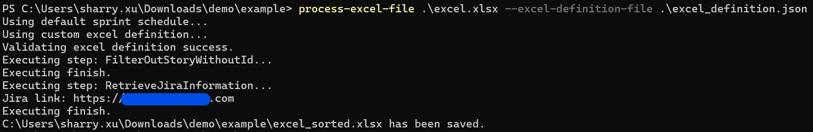
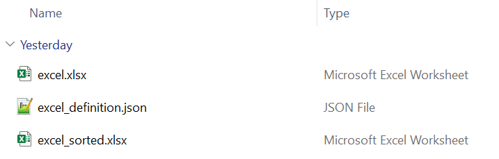
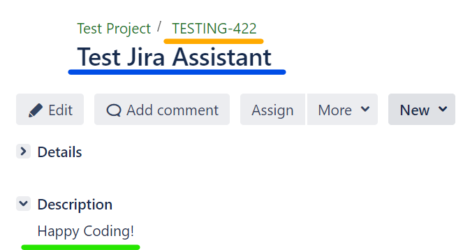

# Gathering Jira Information

Inside this package, there is a shell command named `process-excel-file` and using this tool can help us to retrieve jira ticket's properties. 

## Step 1: Prepare the definition file


```json
[
    {
        "PreProcessSteps": [
            {
                "Name": "FilterOutStoryWithoutId",
                "Enabled": true,
                "Priority": 1,
                "Config": {}
            },
            {
                "Name": "RetrieveJiraInformation",
                "Enabled": true,
                "Priority": 2,
                "Config": {}
            }
        ]
    },
    {
        "Columns": [
            {
                "Index": 1,
                "Name": "storyId",
                "Type": "str",
                "RequireSort": false,
                "SortOrder": false,
                "ScopeRequireSort": false,
                "ScopeSortOrder": false,
                "InlineWeights": 0,
                "RaiseRanking": 0,
                "ScopeRaiseRanking": 0
            },
            {
                "Index": 2,
                "Name": "title",
                "Type": "str",
                "RequireSort": false,
                "SortOrder": false,
                "ScopeRequireSort": false,
                "ScopeSortOrder": false,
                "InlineWeights": 0,
                "RaiseRanking": 0,
                "ScopeRaiseRanking": 0,
                "JiraFieldMapping": {
                    "name": "summary",
                    "path": "summary"
                }
            },
            {
                "Index": 3,
                "Name": "Story Desc",
                "Type": "str",
                "RequireSort": false,
                "SortOrder": false,
                "ScopeRequireSort": false,
                "ScopeSortOrder": false,
                "InlineWeights": 0,
                "RaiseRanking": 0,
                "ScopeRaiseRanking": 0,
                "JiraFieldMapping": {
                    "name": "description",
                    "path": "description"
                },
				"QueryJiraInfo": true
            }
        ]
    }
]
```

## Step 2: Prepare the Excel file

You need to create an excel file like below.


## Step 3: Running the shell command



## Step 4: Congratulations!!!

Now, you can see the **excel_sorted.xlsx** file has been created successfully!



Open the Excel file and compare it with the ticket in the browser.


