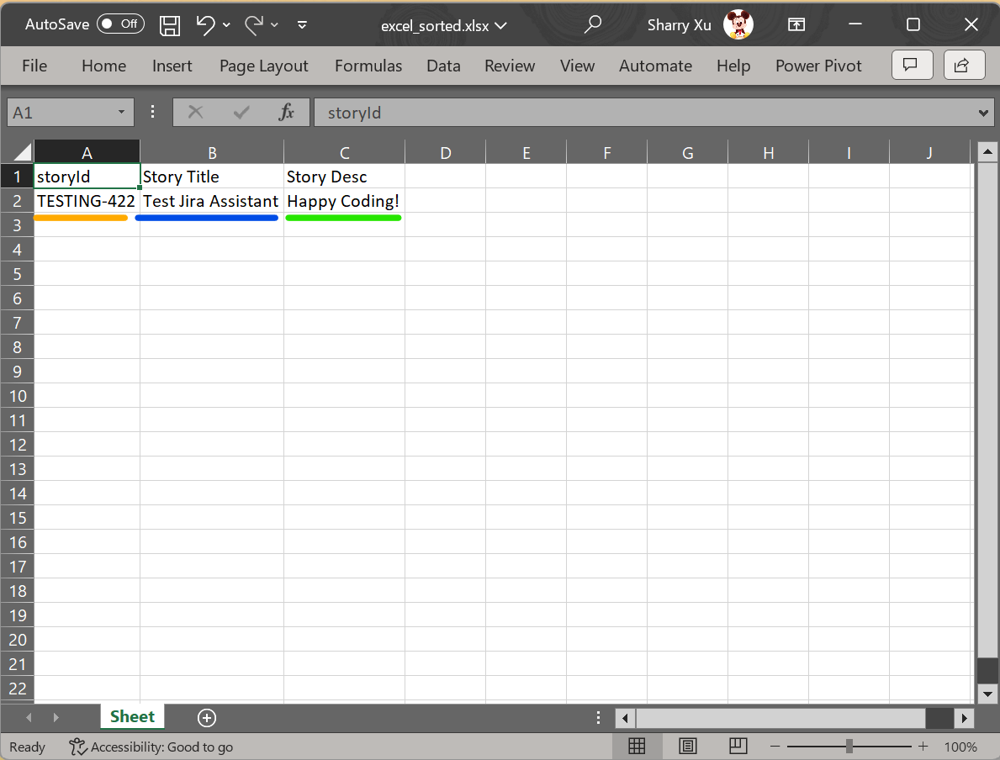

# Gathering Jira Information

This package contains a shell command called `process-excel-file` that can be used to retrieve Jira ticket properties. 

Before proceeding, it is important to ensure that the Jira-related information has been configured correctly. You can use the `update-jira-info` command to configure it, as shown below.


For more information about this command, please refer to the [update_jira_info](../reference/update_jira_info.md) link.

## Step 1: Preparing the Definition File

To connect the file with the Jira platform, we need to create a definition file that contains the `RetrieveJiraInformation` step. This file must have a column named `storyId`, and we recommend using the `FilterOutStoryWithoutId` step to ensure that all `storyId` columns have valid values.

Here is an example file and its text version:


```json
[
    {
        "PreProcessSteps": [
            {
                "Name": "FilterOutStoryWithoutId",
                "Enabled": true,
                "Priority": 1,
                "Config": {}
            },
            {
                "Name": "RetrieveJiraInformation",
                "Enabled": true,
                "Priority": 2,
                "Config": {}
            }
        ]
    },
    {
        "Columns": [
            {
                "Index": 1,
                "Name": "storyId",
                "Type": "str",
                "RequireSort": false,
                "SortOrder": false,
                "ScopeRequireSort": false,
                "ScopeSortOrder": false,
                "InlineWeights": 0,
                "RaiseRanking": 0,
                "ScopeRaiseRanking": 0
            },
            {
                "Index": 2,
                "Name": "title",
                "Type": "str",
                "RequireSort": false,
                "SortOrder": false,
                "ScopeRequireSort": false,
                "ScopeSortOrder": false,
                "InlineWeights": 0,
                "RaiseRanking": 0,
                "ScopeRaiseRanking": 0,
                "JiraFieldMapping": {
                    "name": "summary",
                    "path": "summary"
                }
            },
            {
                "Index": 3,
                "Name": "Story Desc",
                "Type": "str",
                "RequireSort": false,
                "SortOrder": false,
                "ScopeRequireSort": false,
                "ScopeSortOrder": false,
                "InlineWeights": 0,
                "RaiseRanking": 0,
                "ScopeRaiseRanking": 0,
                "JiraFieldMapping": {
                    "name": "description",
                    "path": "description"
                },
				"QueryJiraInfo": true
            }
        ]
    }
]
```

To learn more about this command, please refer to the [template files](../reference/generate_template.md).

## Step 2: Preparing the Excel File

Next, you need to create an Excel file based on the definition file. Here's an example of what the Excel file should look like:


Here's a snapshot of the files you should have created so far:


## Step 3: Running the Shell Command

Run the `process-excel-file` command to get the final result. Here's a screenshot of what it should look like:


## Step 4: Congratulations!

You should now see that the **excel_sorted.xlsx** file has been successfully created!



Compare the ticket displayed in the browser with the **Story Title** and **Story Desc** values in the Excel file to verify that they match.

