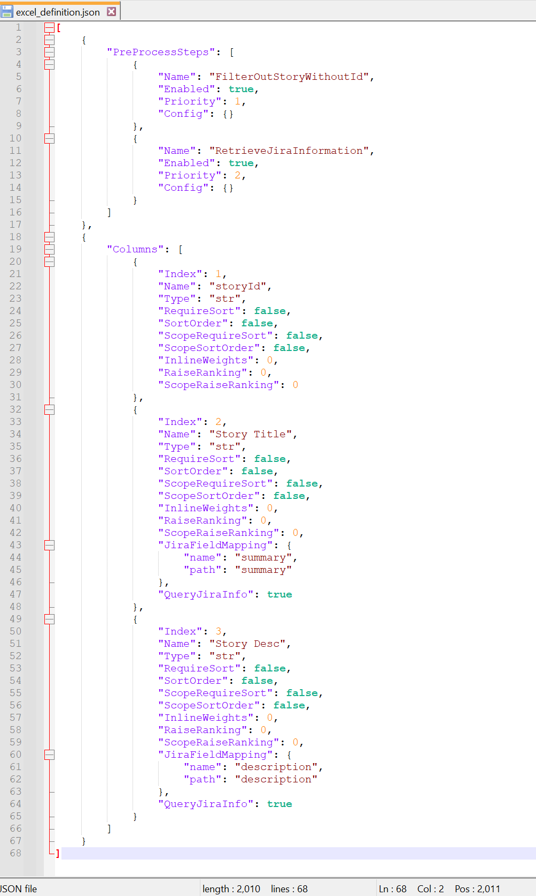
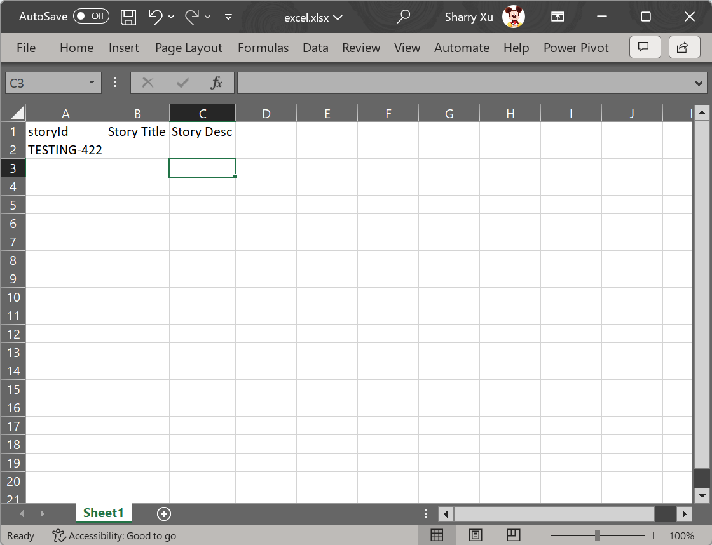

# Gathering Jira Information

Inside this package, there is a shell command named `process-excel-file` and using this tool can help us to retrieve jira ticket's properties. 

Before following below steps, we need to make sure the Jira related information has been configured correctly.
You can run the `update-jira-info` command to do the job like below.


For more info about this command, please check [update_jira_info](../reference/update_jira_info.md).

## Step 1: Prepare the definition file

We need to create a definition file which contains the `RetrieveJiraInformation` step. And since we need to connect this file with Jira platform, a column named `storyId` is required. Step named `FilterOutStoryWithoutId` is also recommended since we need to make sure that all `storyId` column should have the valid value.

Below is an example file and along with text version.



```json
[
    {
        "PreProcessSteps": [
            {
                "Name": "FilterOutStoryWithoutId",
                "Enabled": true,
                "Priority": 1,
                "Config": {}
            },
            {
                "Name": "RetrieveJiraInformation",
                "Enabled": true,
                "Priority": 2,
                "Config": {}
            }
        ]
    },
    {
        "Columns": [
            {
                "Index": 1,
                "Name": "storyId",
                "Type": "str",
                "RequireSort": false,
                "SortOrder": false,
                "ScopeRequireSort": false,
                "ScopeSortOrder": false,
                "InlineWeights": 0,
                "RaiseRanking": 0,
                "ScopeRaiseRanking": 0
            },
            {
                "Index": 2,
                "Name": "title",
                "Type": "str",
                "RequireSort": false,
                "SortOrder": false,
                "ScopeRequireSort": false,
                "ScopeSortOrder": false,
                "InlineWeights": 0,
                "RaiseRanking": 0,
                "ScopeRaiseRanking": 0,
                "JiraFieldMapping": {
                    "name": "summary",
                    "path": "summary"
                }
            },
            {
                "Index": 3,
                "Name": "Story Desc",
                "Type": "str",
                "RequireSort": false,
                "SortOrder": false,
                "ScopeRequireSort": false,
                "ScopeSortOrder": false,
                "InlineWeights": 0,
                "RaiseRanking": 0,
                "ScopeRaiseRanking": 0,
                "JiraFieldMapping": {
                    "name": "description",
                    "path": "description"
                },
				"QueryJiraInfo": true
            }
        ]
    }
]
```

For more info about this command, please check [template files](../reference/generate_template.md).

## Step 2: Prepare the Excel file

Now, we can create the Excel file according to the definition file.



Below snapshot shows what kind of files we've created for now.


## Step 3: Running the shell command

Running the `process-excel-file` can give us the final result.


## Step 4: Congratulations!!!

Now, you can see the **excel_sorted.xlsx** file has been created successfully!


And compare with the ticket showed in the browser, you can see the **Story Title** and the **Story Desc** inside the Excel file have the correct value from the Jira ticket.

