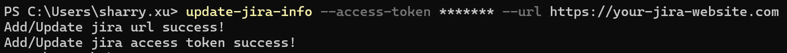
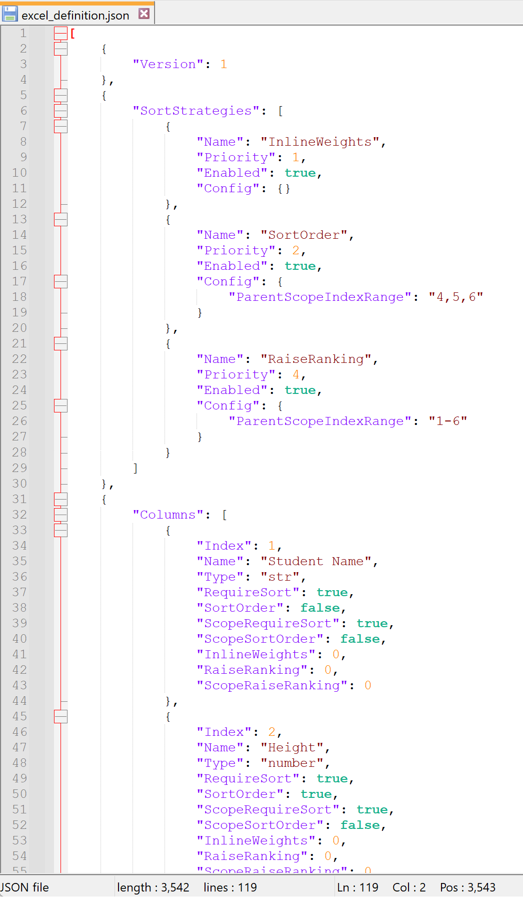
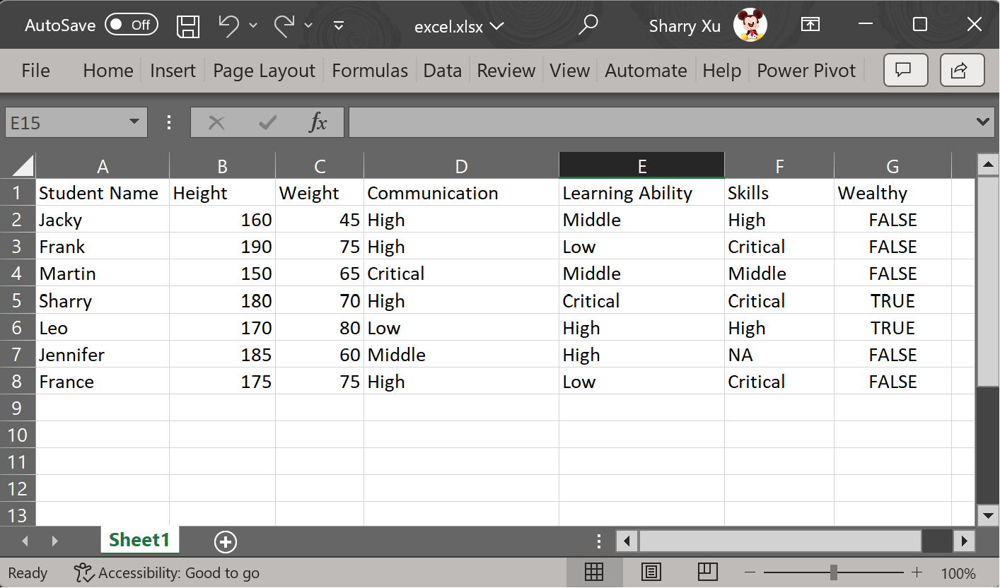
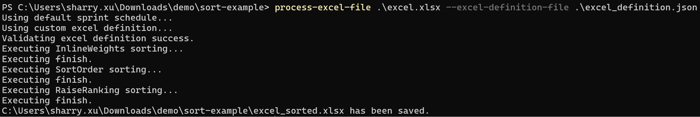
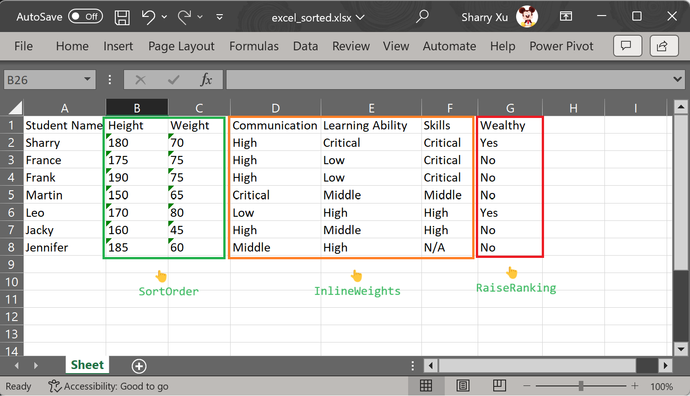

# Using multiple sort strategy to sort Excel file

Inside this package, there is a shell command named `process-excel-file` and using this tool can help you sort the Excel file.

Before following below steps, we need to make sure the Jira related information has been configured correctly.
You can run the `update-jira-info` command to do the job like below.



For more info about this command, please check [update_jira_info](../reference/update_jira_info.md).

## Step 1: Prepare the definition file

We need to create a definition file which contains the **SortStrategies** part. 

Inside this part, we applied **3** different strategies.

The `InlineWeights` strategy has the top priority so it will be triggered first. It will take columns of which `InlineWeights` value is bigger than **0** into consideration.
In this case, there are **Communication**, **Learning Ability** and **Skills**.

The second strategy is `SortOrder`. It will take columns of which `ScopeRequireSort` is `true` into consideration.
In this case, there are **Student Name**, **Height** and **Weight**. 
The `ParentScopeIndexRange` inside this strategy's config guarantee the parent level sort order will not be effected.

And the last strategy is `RaiseRanking`. It means each column of which `ScopeRaiseRanking` value is bigger than **0** into consideration.
In this case, only **Wealthy** column will be applied to this strategy.
The `ParentScopeIndexRange` inside this strategy's config guarantee the parent level sort order will not be effected.

Below is the example file and along with text version.



```json
[
	{
		"Version": 1
	},
	{
		"SortStrategies": [
            {
                "Name": "InlineWeights",
                "Priority": 1,
                "Enabled": true,
                "Config": {}
            },
            {
                "Name": "SortOrder",
                "Priority": 2,
                "Enabled": true,
                "Config": {
					"ParentScopeIndexRange": "4,5,6"
				}
            },
            {
                "Name": "RaiseRanking",
                "Priority": 4,
                "Enabled": true,
                "Config": {
                    "ParentScopeIndexRange": "1-6"
                }
            }
        ]
	},
    {
        "Columns": [
			{
                "Index": 1,
                "Name": "Student Name",
                "Type": "str",
                "RequireSort": true,
                "SortOrder": false,
                "ScopeRequireSort": true,
                "ScopeSortOrder": false,
                "InlineWeights": 0,
                "RaiseRanking": 0,
                "ScopeRaiseRanking": 0
            },
            {
                "Index": 2,
                "Name": "Height",
                "Type": "number",
                "RequireSort": true,
                "SortOrder": true,
                "ScopeRequireSort": true,
                "ScopeSortOrder": false,
                "InlineWeights": 0,
                "RaiseRanking": 0,
                "ScopeRaiseRanking": 0
            },
            {
                "Index": 3,
                "Name": "Weight",
                "Type": "number",
                "RequireSort": true,
                "SortOrder": false,
                "ScopeRequireSort": true,
                "ScopeSortOrder": false,
                "InlineWeights": 0,
                "RaiseRanking": 0,
                "ScopeRaiseRanking": 0
            },
			{
                "Index": 4,
                "Name": "Communication",
                "Type": "priority",
                "RequireSort": false,
                "SortOrder": false,
                "ScopeRequireSort": false,
                "ScopeSortOrder": false,
                "InlineWeights": 1,
                "RaiseRanking": 0,
                "ScopeRaiseRanking": 0
            },
			{
                "Index": 5,
                "Name": "Learning Ability",
                "Type": "priority",
                "RequireSort": false,
                "SortOrder": false,
                "ScopeRequireSort": false,
                "ScopeSortOrder": false,
                "InlineWeights": 2,
                "RaiseRanking": 0,
                "ScopeRaiseRanking": 0
            },
			{
                "Index": 6,
                "Name": "Skills",
                "Type": "priority",
                "RequireSort": false,
                "SortOrder": false,
                "ScopeRequireSort": false,
                "ScopeSortOrder": false,
                "InlineWeights": 3,
                "RaiseRanking": 0,
                "ScopeRaiseRanking": 0
            },
			{
                "Index": 7,
                "Name": "Wealthy",
                "Type": "bool",
                "RequireSort": false,
                "SortOrder": false,
                "ScopeRequireSort": false,
                "ScopeSortOrder": false,
                "InlineWeights": 0,
                "RaiseRanking": 1,
                "ScopeRaiseRanking": 0
            }
        ]
    }
]
```

## Step 2: Prepare the Excel file

Now, we can create the Excel file according to the definition file.



## Step 3: Running the shell command

Running the `process-excel-file` can give us the final result.



## Step 4: Congratulations!!!

Now, you can see the **excel_sorted.xlsx** file has been created successfully!

