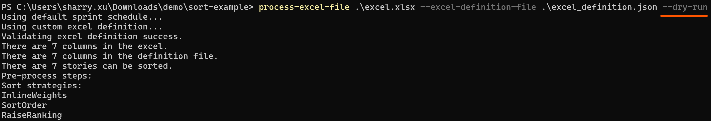

# Using multiple sort strategy to sort Excel file

To sort an Excel file, you can use the shell command `process-excel-file`. 

Before starting, ensure that the Jira related information is configured correctly by running the `update-jira-info` command.


For more info about this command, please check [update_jira_info](../reference/update_jira_info.md).

## Step 1: Prepare the definition file

To begin, create a definition file with the **SortStrategies** section. Three strategies have been applied: 

1. The `InlineWeights` strategy has the highest priority and takes into account columns with an `InlineWeights` value greater than 0. In this case, **Communication**, **Learning Ability**, and **Skills** are considered.

2. The `SortOrder` strategy considers columns with `ScopeRequireSort` set to `true` and does not affect the parent level sort order. In this example, **Student Name**, **Height**, and **Weight** are considered.

3. The `RaiseRanking` strategy considers columns with a `ScopeRaiseRanking` value greater than 0 and also does not affect the parent level sort order. In this case, only the **Wealthy** column is considered.
The `ParentScopeIndexRange` inside this strategy's config guarantee the parent level sort order will not be effected.

The example file and its text version are provided below.


```json
[
	{
		"Version": 1
	},
	{
		"SortStrategies": [
            {
                "Name": "InlineWeights",
                "Priority": 1,
                "Enabled": true,
                "Config": {}
            },
            {
                "Name": "SortOrder",
                "Priority": 2,
                "Enabled": true,
                "Config": {
		            "ParentScopeIndexRange": "4,5,6"
		        }
            },
            {
                "Name": "RaiseRanking",
                "Priority": 4,
                "Enabled": true,
                "Config": {
                    "ParentScopeIndexRange": "1-6"
                }
            }
        ]
	},
    {
        "Columns": [
			{
                "Index": 1,
                "Name": "Student Name",
                "Type": "str",
                "RequireSort": true,
                "SortOrder": false,
                "ScopeRequireSort": true,
                "ScopeSortOrder": false,
                "InlineWeights": 0,
                "RaiseRanking": 0,
                "ScopeRaiseRanking": 0
            },
            {
                "Index": 2,
                "Name": "Height",
                "Type": "number",
                "RequireSort": true,
                "SortOrder": true,
                "ScopeRequireSort": true,
                "ScopeSortOrder": false,
                "InlineWeights": 0,
                "RaiseRanking": 0,
                "ScopeRaiseRanking": 0
            },
            {
                "Index": 3,
                "Name": "Weight",
                "Type": "number",
                "RequireSort": true,
                "SortOrder": false,
                "ScopeRequireSort": true,
                "ScopeSortOrder": false,
                "InlineWeights": 0,
                "RaiseRanking": 0,
                "ScopeRaiseRanking": 0
            },
			{
                "Index": 4,
                "Name": "Communication",
                "Type": "priority",
                "RequireSort": false,
                "SortOrder": false,
                "ScopeRequireSort": false,
                "ScopeSortOrder": false,
                "InlineWeights": 1,
                "RaiseRanking": 0,
                "ScopeRaiseRanking": 0
            },
			{
                "Index": 5,
                "Name": "Learning Ability",
                "Type": "priority",
                "RequireSort": false,
                "SortOrder": false,
                "ScopeRequireSort": false,
                "ScopeSortOrder": false,
                "InlineWeights": 2,
                "RaiseRanking": 0,
                "ScopeRaiseRanking": 0
            },
			{
                "Index": 6,
                "Name": "Skills",
                "Type": "priority",
                "RequireSort": false,
                "SortOrder": false,
                "ScopeRequireSort": false,
                "ScopeSortOrder": false,
                "InlineWeights": 3,
                "RaiseRanking": 0,
                "ScopeRaiseRanking": 0
            },
			{
                "Index": 7,
                "Name": "Wealthy",
                "Type": "bool",
                "RequireSort": false,
                "SortOrder": false,
                "ScopeRequireSort": false,
                "ScopeSortOrder": false,
                "InlineWeights": 0,
                "RaiseRanking": 1,
                "ScopeRaiseRanking": 0
            }
        ]
    }
]
```

## Step 2: Prepare the Excel File

We can now create the Excel file based on the definition file.


## Step 3: Running the Shell Command

Running the `process-excel-file` command will give us the final result.


## Step 4: Congratulations!

You can now see that the **excel_sorted.xlsx** file has been created successfully!


## Additional Information

If you only want to know which steps will be triggered or want to see detailed information about the Excel or definition file, you can append the `--dry-run` option to the command before running it.

