# Template Files

After [installation](../installation/install_jira_assistant.md), the `generate-template` command will be installed. You can type `generate-template -h` in the shell to verify.

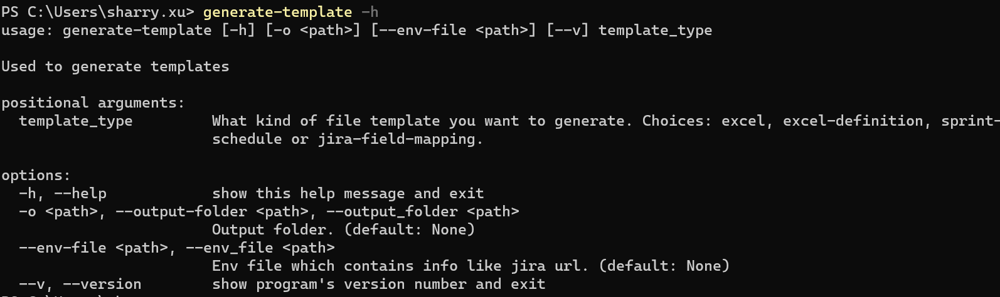

You can use this command to get all file examples you will need when you are using this package.

> ## Excel

> You can type command `generate-template excel` in the shell then you will see an Excel file has been created in the current folder like below.

> 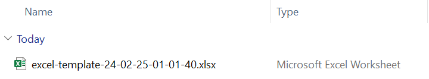

> Notice: If you want to put the output file to other folder, you can use the `--output-folder` to specify.

> Below is what's inside the Excel file.

> 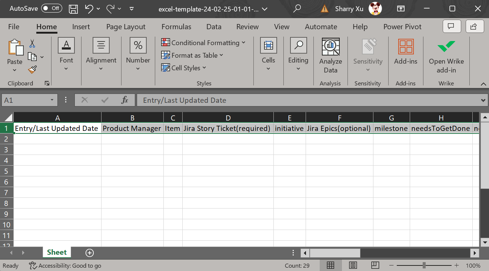

> ## Excel Definition

> Like previous command, you can type command `generate-template excel-definition` in the shell to create an 
> file which contain the related definition info. In the definition file, you can define the Excel 
> column name, sort strategies or process steps, etc.

> 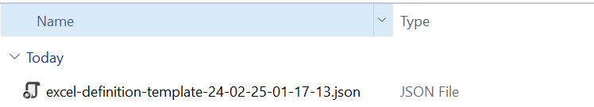

> Now, let's take a look at what inside the definition file.

> 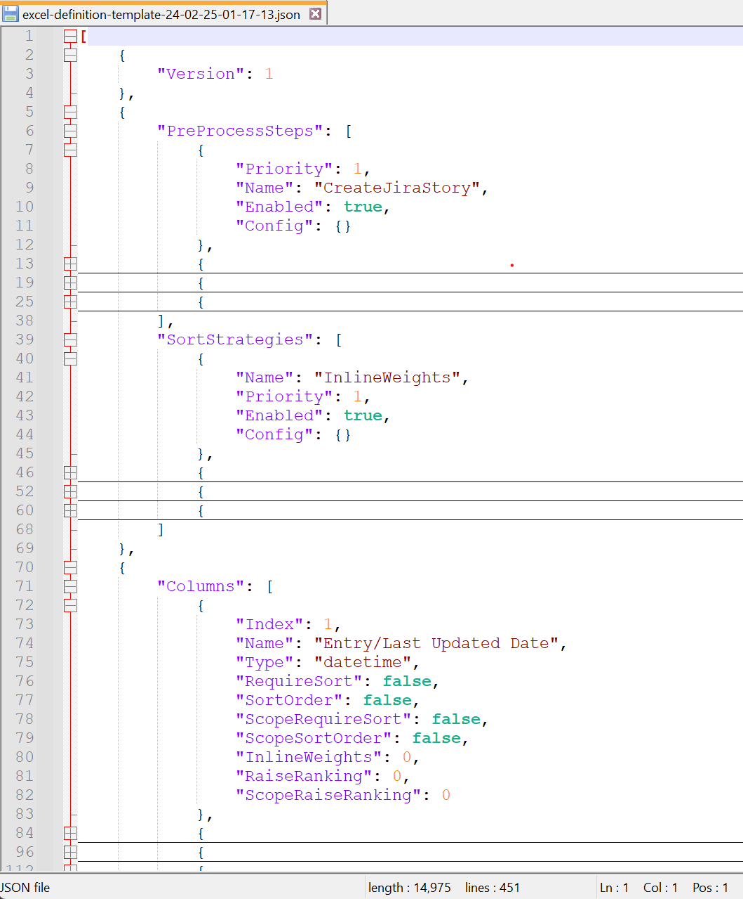

> The file composed by 4 parts: **basic file info**, **pre-process step**, **sort strategy** and **column info**.

>> ### Basic File Info

>> This part currently only support the `Version` configuration.

>> ### Pre-Process Step

>> There are **3** kinds of steps. Each step has the `Enabled` and `Priority` property. 
>> The `Enabled` property indicate whether the step has been applied or not. And the `Priority` property defines the running sequence.

>>> ##### 1. Create Jira Story

>>> This step's name is `CreateJiraStory`. When this step is applyed, it will create Jira story 
>>> for each record in the Excel of which don't have the `storyId` (a column inside the Excel) value.
>>> Quickstart: [Create-Jira-Story](../quick_start/create_jira_story.md)

>>> ##### 2. Filter Out Story

>>> This step has **2** seperate types. 

>>> One is based on the `StoryId` (a column inside the Excel) called `FilterOutStoryWithoutId`. 
>>> This step means if the value of the `storyId` is empty, this record will be filtered out and following steps will not process it.

>>> Another is based on the Jira `status` (a column inside the Excel) called `FilterOutStoryBasedOnJiraStatus`.
>>> This step means it will filter out the record based on the value of the `status`. 
>>> If the `status` matches of any status which configed in the `JiraStatuses` property (inside the `Config` property), then
>>> this record will not be processed by any of the following steps.
>>> Below piece of JSON shows how to config:

```json
            {
                "Priority": 1,
                "Name": "FilterOutStoryBasedOnJiraStatus",
                "Enabled": true,
                "Config": {
                    "JiraStatuses": [
                        "SPRINT COMPLETE",
                        "PENDING RELEASE",
                        "PRODUCTION TESTING",
                        "CLOSED"
                    ]
                }
            }
```


>>> ##### 3. Query Jira Information

>>> This step's name is `RetrieveJiraInformation`. It will use the `JiraFieldMapping` property inside 
>>> the column definition to decide how to query the value from the Jira platform.
>>> Quickstart: [Gathering-Jira-Info](../quick_start/gathering_jira_info.md)

>> ### Sort Strategy

>> There are **3** kinds of strategies. And like the **Pre-Process Step**, each strategy has the `Enabled` and `Priority` property.

>>> ##### 1. Inline Weights 

>>> This step's name is `InlineWeights`. Currently, ONLY column of which type is **priority** support this strategy.

>>> ##### 2. Sort Order

>>> This step's name is `SortOrder`.

>>> ##### 3. Raise Ranking

>>> This step's name is `RaiseRanking`.

>> ### Column Info

>> This part describes the Excel file definition and the relationship between the columns inside the Excel and the Jira platform.

>> #### `Index`
>>> Need to start from **1** to **N**. Support: `1`, `2` and so on.
>> #### `Name`
>>> Should be the same name from the Excel file. 
>> Cannot be empty string or duplicate in the definition file.
>> #### `Type`
>>> Currently, we support `str` *(string)*, `bool` *(true/false)*, `datetime` 
>>> *(datetime)*, `priority` *(priority)*, `milestone` *(sprint)* and `number` *(digital number)*.
>> #### `RequireSort`
>>> Indicate whether the column need be sorted or not. Support: `true`/`false`.
>> #### `SortOrder`
>>> Indicate the sort order. Support: `true` *(descending)* /`false` *(ascending)*.
>> #### `ScopeRequireSort`
>>> Same as `RequireSort` but add scope limition. 
>>> The scope range will be configed in the *Sort Strategy*.
>> #### `ScopeSortOrder`
>>> Same as `SortOrder` but applied to the `ScopeRequireSort` option.
>> #### `InlineWeights`
>>> Indicate the weight of the column. Support: `0` *(no weight)* or `*`.
>> #### `RaiseRanking`
>>> Indicate whether the current record need to be raised to the top of the list or not.
>>> Only support column which `Type` is `bool`.
>> #### `ScopeRaiseRanking`
>>> Same as `RaiseRanking` but add scope limition.
>> #### `JiraFieldMapping`
>>> Indicate the relationship with Jira ticket.
>> #### `QueryJiraInfo`
>>> Indicate whether the column need to query the Jira platform when executing the `RetrieveJiraInformation` pre-step.

> ## Sprint Schedule

> You can type command `generate-template sprint-schedule` in the shell then you will see an JSON file has been created in the current folder like below.

> 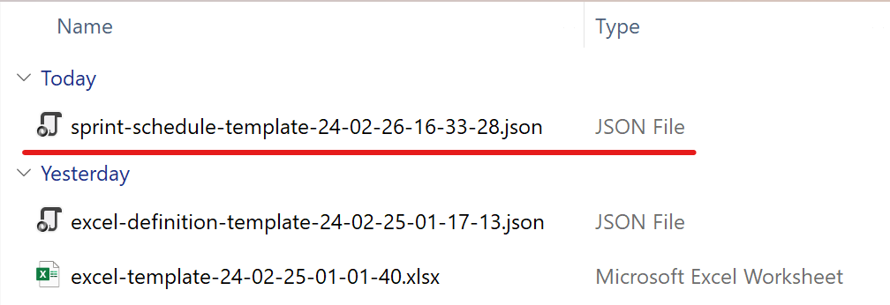

> Now, let's take a look at what inside this file.

> 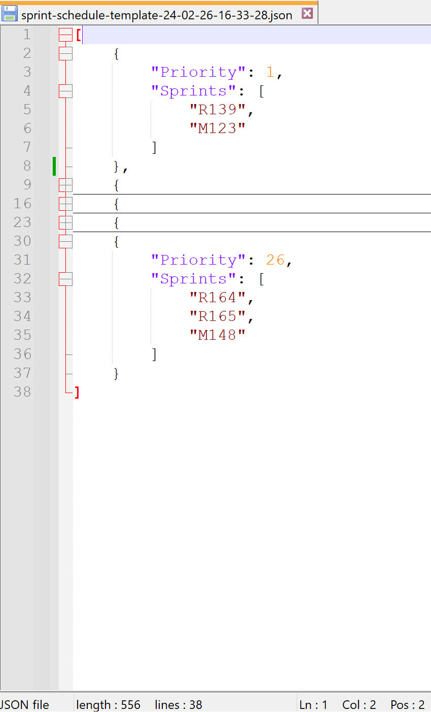

> Column of which type is `milestone` will use this file to decide how to sort records.

> ## Jira Field Mapping

> You can type command `generate-template jira-field-mapping` in the shell then you will see an JSON file has been created in the current folder like below.

> 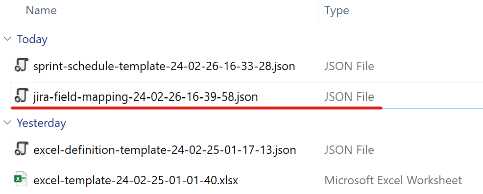

> Now, let's take a look at what inside this file.

> 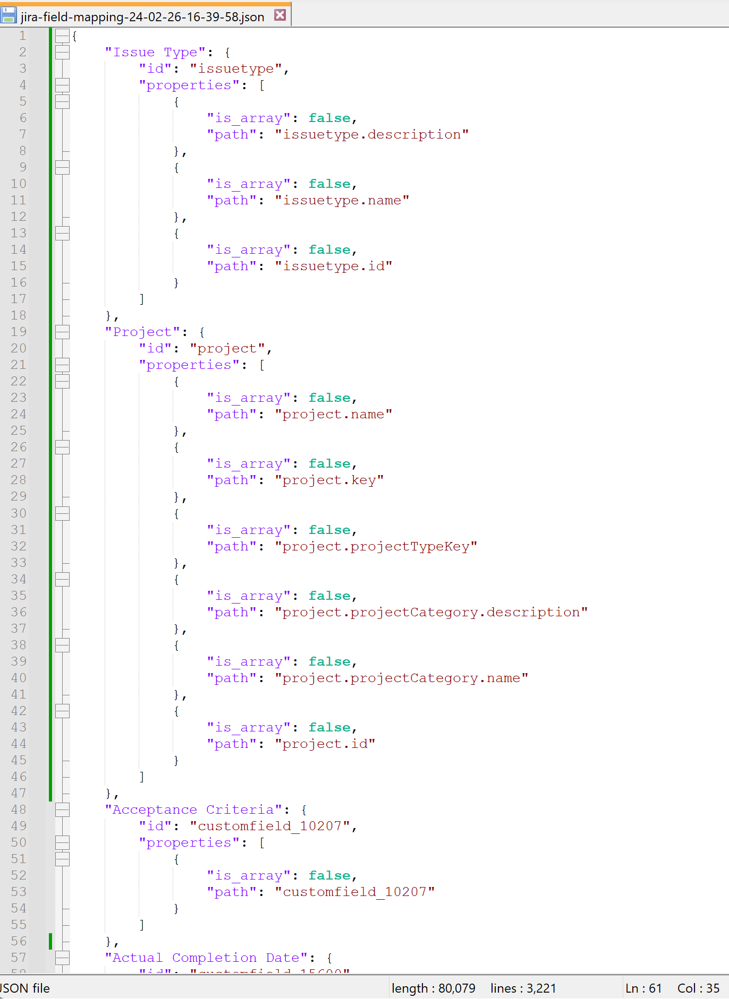

> To understand this part, you need to have a little bit knowledge about the [Jira REST API](https://developer.atlassian.com/cloud/jira/platform/rest/v2/intro/).

> Usually, in our day-to-day job, we are directly using the UI like website to operate the Jira. But actually, it can be operated through the API.
> For example, if you want to visit a ticket, you don't need to open it in the browser, instead you can call API to get the info like below. 

> 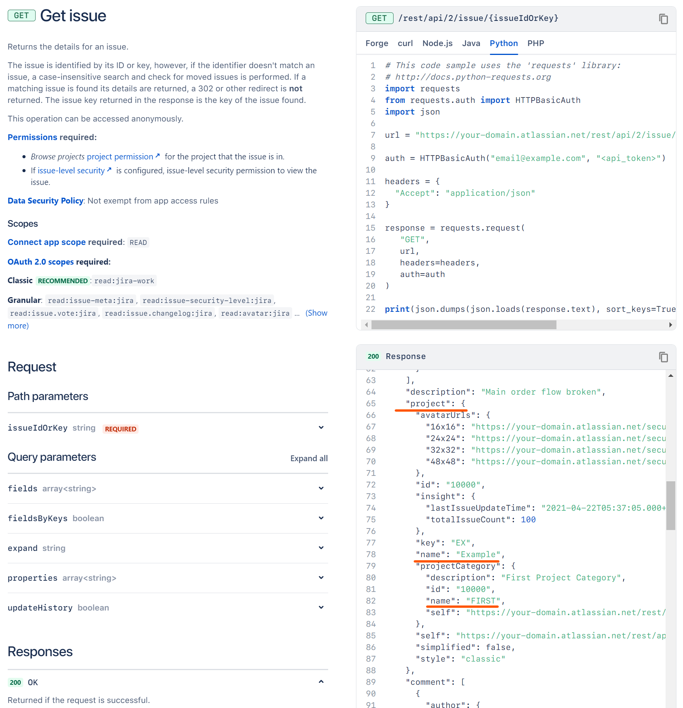

> As we can see, the project name of this ticket is **Example** and the project category name is **FIRST**.
> Let's say you want to query this info and put it into the **Project Category Name** column inside the Excel file.
> What you need to do is searching the mapping file you just generated by this command, finding a unique item of which `key` is **id** and `value` is **Project**.

> 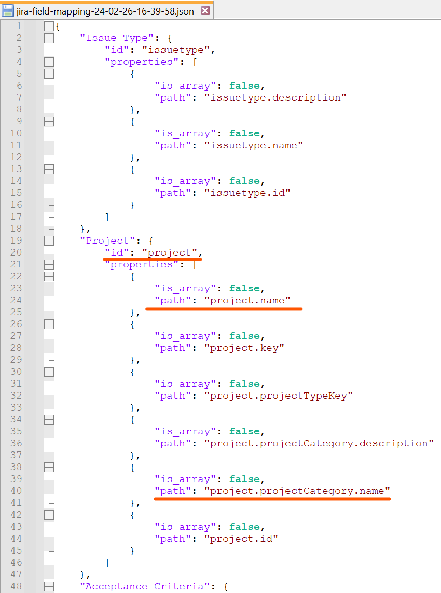

> Then, picking the `path` information from it and put it into the `JiraFieldMapping` of the **Column Info** like below.

> 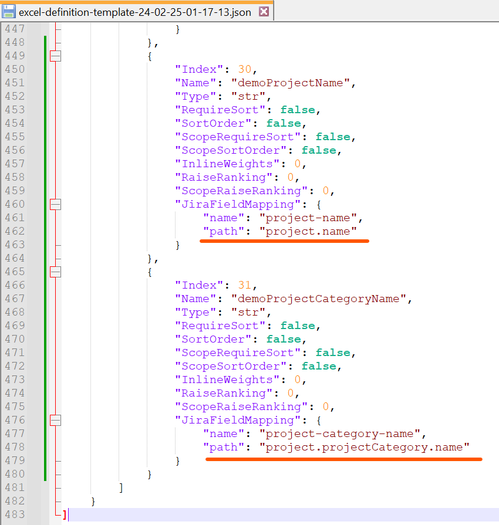

> That's it. You can query the Jira info for these two fields.