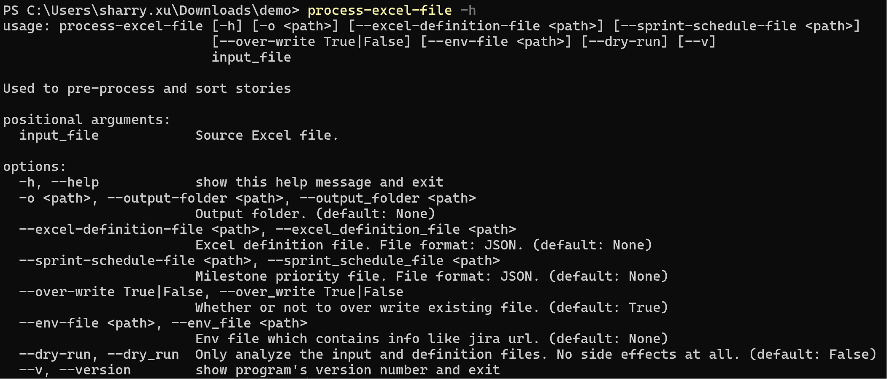

# Process Excel File

After [installation](../installation/install_jira_assistant.md), the `process-excel-file` command will be installed. You can type `process-excel-file -h` in the shell to verify.

You can check below pages to get started. 

1. [Query Jira information](../quick_start/gathering_jira_info.md)
2. [Sort Excel file](../quick_start/sort_excel_file.md)
3. [Create Jira story](../quick_start/create_jira_story.md)

