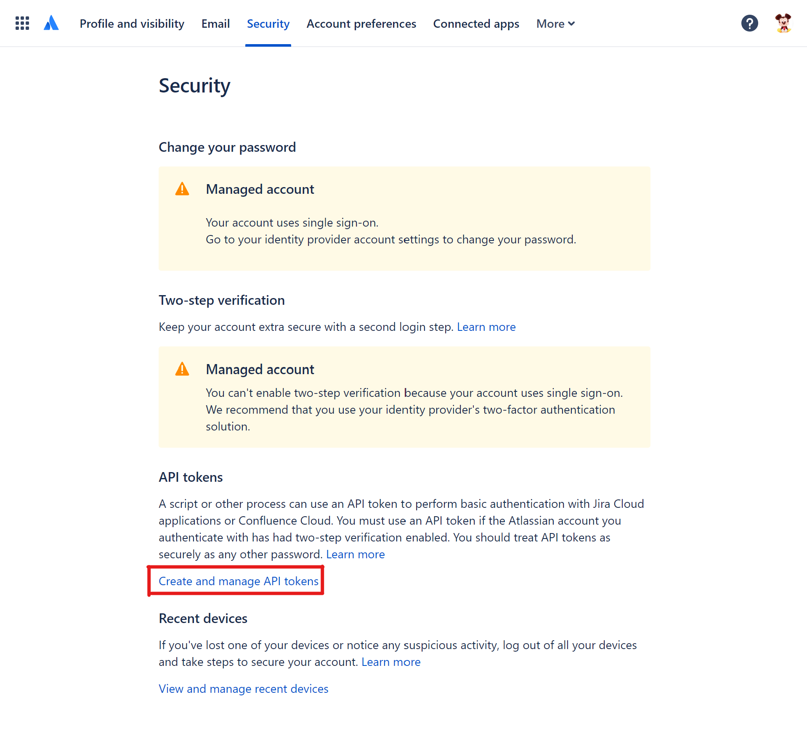
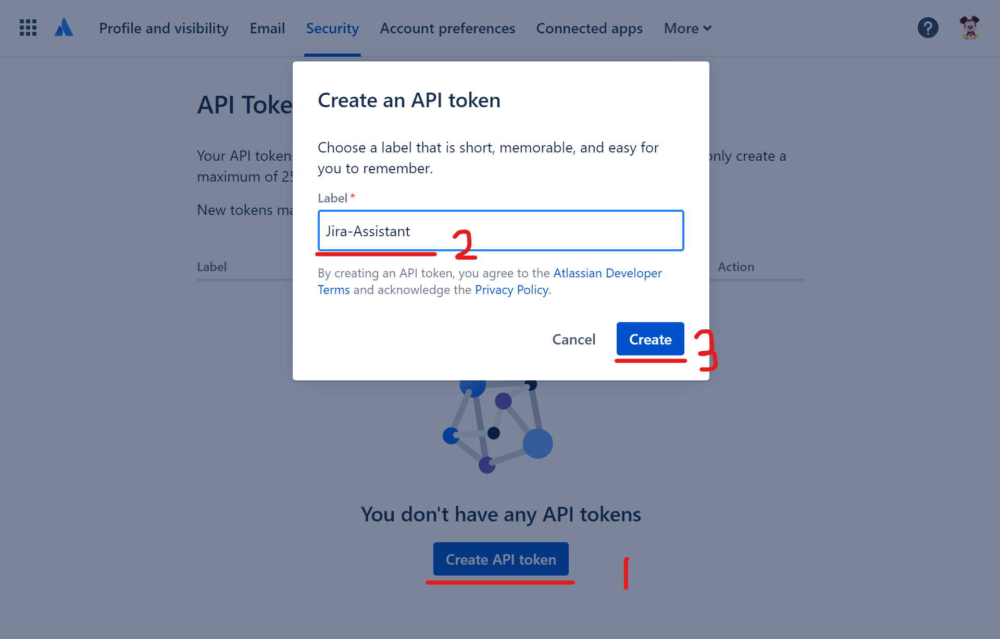
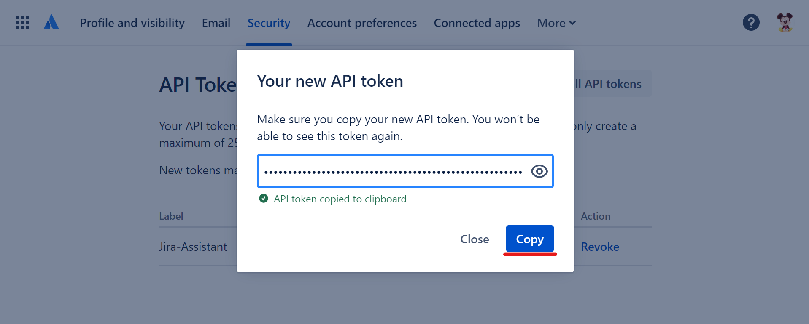

# Add/Update Jira Information

After you install the Jira assistant, you can verify by typing `update-jira-info -h` in the shell.

## Options

**`-h` and `--help`**

> Print out the help message and tell the user how to run the command.

**`--access-token`**

> Used by Jira API inside the package.
> Check [this](#access-token) for more info.

**`--url`**

> Used by Jira API inside the package.
> Check [this](#url) for more info.

**`--user-email`**

> Used by Jira API inside the package.
> Check [this](#user-email) for more info.

**`--env-file`**

> The location where you would like to read the environment file.
> Absolute or relative paths are all supported.

> **Default: Environment file inside the package.**

> Check [this](#environment-file) for more info.

**`--v` and `--version`**

> Print out the **version** info.

> ## Access Token

> ### Jira Server

> Currently, this package uses the Basic Authentication to connect/operate with the Jira platform.
> Here we are using the self-host Jira platform as an example to show you how to generate an API token.

> First, you must log into the platform and navigate your profile page. After you choose the **Personal Access Tokens** tab on the left of the window, you can see the below page.

> 

> Now, you can click the **Create token** button at the top of the window. Then a new form will be shown.

> 

> After you click the **Create** button, you can see a new token has been created.

> 

> ### Jira Cloud

> We use the [ATLASSIAN Account site](https://id.atlassian.com/manage-profile/security) to generate the token.

> 

> Now, you can follow the red number sequence to create a new token.

> 

> After you click the **Create** button, you can see a new token has been created and you need to click the **Copy** button to have it.

> 

> If you want to know more about Authentication/Authorization, please check the below documentation.

> 1. [Basic Authentication for Jira](https://developer.atlassian.com/cloud/jira/software/basic-auth-for-rest-apis)
> 2. [API tokens used by Jira Server](https://confluence.atlassian.com/enterprise/using-personal-access-tokens-1026032365.html)
> 3. [API tokens used by Jira Cloud](https://support.atlassian.com/atlassian-account/docs/manage-api-tokens-for-your-atlassian-account/)

> ## URL

> This is the Jira website URL you use to visit in the browser.

> ## USER EMAIL

> This is the email address your Jira website display. It's a required field if you are using Jira Cloud.

> ## Environment File

> By default, the **AccessToken** and the **URL** parameters will be add/updated in the default env file which is located inside the package folder after installation.
> This option gives you the ability to create/update your env file so that it can be used in other commands like `process-excel-file` or `generate-template`.

> **Notice: This behavior only applies for the duration of the current command.**