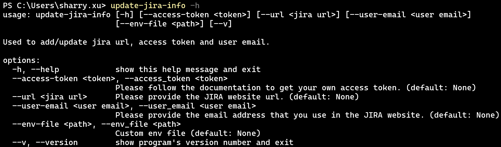

# Add/Update Jira Information

After [installation](../installation/install_jira_assistant.md), the `update-jira-info` command will be installed. You can type `update-jira-info -h` in the shell to verify.

## Options

**`-h` and `--help`**

> Print out the help message and tell the user how to run the command.

**`--access-token`**

> Used by Jira API inside the package.
> Check [this](#access-token) for more info.

**`--url`**

> Used by Jira API inside the package.
> Check [this](#url) for more info.

**`--env-file`**

> Indicate the environment file.
> Absolute or relative path are all supported.

> **Default: Environment file inside the package.**

> Check [this](#environment-file) for more info.

**`--v` and `--version`**

> Print out the **version** info.

> ## Access Token

> Currently, this package using the Basic Authentication to connect/operate with Jira platform.
> Here we are using the self-host Jira platform as an example to show you how to generate an API token.

> First, you need to login the platform and navigate to your profile page. After you choose the **Personal Access Tokens** tab in the left of the window, you can see below page.

> 

> Now, you can click the **Create token** button on the right top of the window. Then a new form will be showed.

> 

> After you click the **Create** button, you can see a new token has been created.

> 

> Documentation: [https://confluence.atlassian.com/enterprise/using-personal-access-tokens-1026032365.html](https://confluence.atlassian.com/enterprise/using-personal-access-tokens-1026032365.html)

> If you are using Jira Cloud, check this [article](https://support.atlassian.com/atlassian-account/docs/manage-api-tokens-for-your-atlassian-account/) about how to manage API tokens.

> If you want to know more about the Authentication/Authorization, please check below documentation.

> [https://developer.atlassian.com/cloud/jira/software/basic-auth-for-rest-apis](https://developer.atlassian.com/cloud/jira/software/basic-auth-for-rest-apis)

> ## URL

> This is the Jira website URL that you are using to visit in the browser.

> ## Environment File

> By default, the **AccessToken** and the **URL** parameter will be add/update in the default env file which located inside the package folder after installation.
> This option gives you an ability to create/update your own env file so that it can be used in other commands like `process-excel-file` or `generate-template`.

> **Notice: This behavior only has effect when executing current command.**