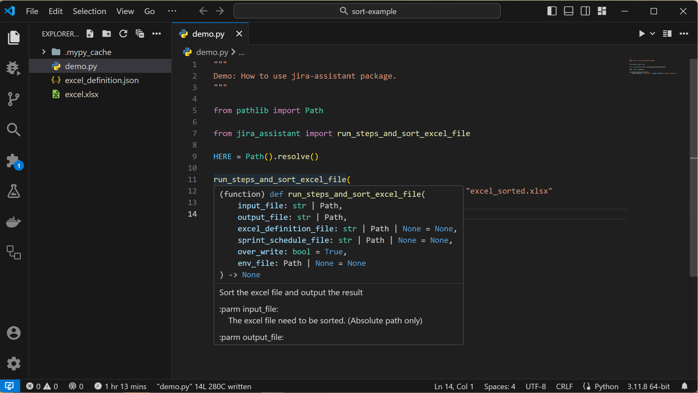
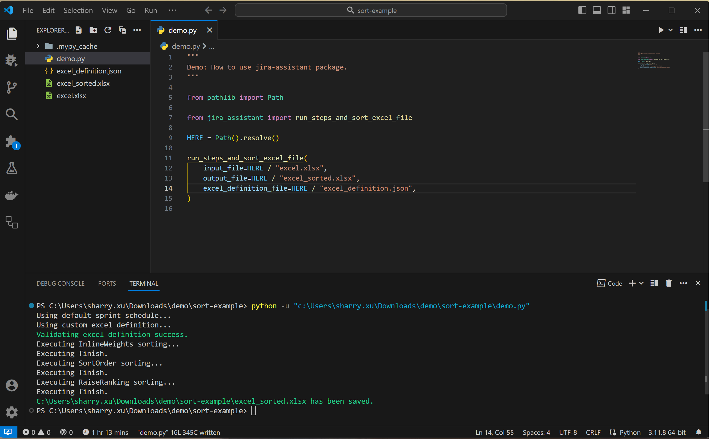

# Developer Perspective

After [installation](../installation/install_jira_assistant.md), we can directly use the package insdie our python code.

Here's a simple program, just to give you an idea about how to use this package.

For more info about the parameters of the `run_steps_and_sort_excel_file` command, please check [here](../reference/process_excel_file.md).

